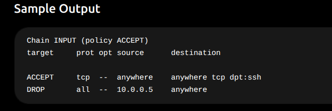

# How to debug ip tables in k8s? 

This is exactly where many DevOps candidates struggle. They memorize commands but don't know:

1. **Why we run the command**
2. **How to read the output**
3. **What problem it helps solve**
4. **What action to take after seeing the output**

Let's learn these from a Kubernetes/DevOps/SRE troubleshooting perspective.

---

# 1. IPTables

## Command

```bash
iptables -L
```

## Why Do We Run It?

To check firewall rules on a Linux server.

Common scenarios:

- Pod cannot reach another Pod
- Service not accessible
- Port blocked
- Network troubleshooting

---



---

## How To Read It

### Rule 1

```
ACCEPT tcp anywhere anywhere tcp dpt:ssh
```

Means:

```
Allow SSH traffic
Port 22
```

---

### Rule 2

```
DROP all 10.0.0.5 anywhere
```

Means:

```
Block all traffic
coming from 10.0.0.5
```

---

## Real Production Issue

Developer says:

```
Application unreachable
```

You check:

```bash
iptables -L
```

Output:

```
DROP tcp anywhere anywhere tcp dpt:8080
```

Problem found:

```
Port 8080 blocked
```

Fix:

```bash
iptables -D INPUT rule-number
```

or

```bash
iptables -F
```

(Only if safe)

Here's an example of how to use the `iptables -D` command to delete a specific rule from the INPUT chain:

# Alternative commands
```
sudo iptables-D INPUT-p tcp--dport22-j DROP
```

or

```
sudo iptables-A INPUT-p tcp--dport22-j ACCEPT
```
### Example Scenario

Let's say you have the following rules in your INPUT chain:

1. Accept established connections
2. Drop invalid packets
3. Allow SSH traffic on port 22
4. Allow HTTP traffic on port 80

If you want to delete the rule that allows SSH traffic (which is rule number 3), you would first list the rules to confirm the rule number:

```bash
iptables -L INPUT --line-numbers
```

The output might look something like this:

```
Chain INPUT (policy ACCEPT)
num  target     prot opt source               destination
1    ACCEPT     all  --  anywhere             anywhere             state ESTABLISHED
2    DROP       all  --  anywhere             anywhere             state INVALID
3    ACCEPT     tcp  --  anywhere             anywhere             tcp dpt:22
4    ACCEPT     tcp  --  anywhere             anywhere             tcp dpt:80
```

### Deleting the Rule

To delete the rule allowing SSH traffic, you would run:

```bash
iptables -D INPUT 3
```

### Explanation

- This command deletes the rule at position 3 in the INPUT chain, which allows SSH traffic on port 22.
- After executing this command, you can verify that the rule has been removed by listing the rules again:

```bash
iptables -L INPUT --line-numbers
```

Now, the output should no longer include the rule for SSH traffic.

---

# Command 2

```
sudo iptables-t nat-L
```

This is far more important for Kubernetes.

---

# What Is NAT?

Network Address Translation.

Converts one IP into another.

Example:

```
Service IP
10.96.0.10
```

actually forwards traffic to

```
Pod IP
10.244.1.15
```

How?

Using NAT rules.

---

# Kubernetes Uses NAT Everywhere

Example:

```
Client
  |
Service IP
10.96.0.100
  |
NAT Rule
  |
Pod
10.244.1.12
```

---

# Example Output

```
Chain KUBE-SERVICES

target    prot source  destination

KUBE-SVC-ABC123
```

This was created automatically by:

```
Kube Proxy
```

---

# Real Production Scenario 1

Service Not Working

---

You create:

```
kubectl expose deployment nginx
```

Service gets created.

---

Check Service:

```
kubectlget svc
```

Output:

```
nginx-service
10.96.10.25
```

---

But:

```
curl10.96.10.25
```

fails.

---

Now check NAT table:

```
iptables-t nat-L
```

Look for:

```
KUBE-SERVICES
```

---

If missing:

```
Kube Proxy problem
```

---

# Investigation

Check:

```
kubectlget pods-n kube-system
```

Verify:

```
kube-proxy Running?
```

---

Fix:

```
kubectl rolloutrestart daemonset kube-proxy-n kube-system
```
This command is commonly used when:

- You need to apply new configurations or updates to the `kube-proxy` component.
- You want to troubleshoot issues related to networking in the cluster.
- You need to refresh the DaemonSet pods without taking down the entire service.
  - Reason: 
  Refreshing the DaemonSet pods without taking down the entire service ensures that the application remains available and responsive during updates. This approach enhances service reliability and user experience by preventing disruptions that could occur if all instances were taken down simultaneously.
  We run this to refresh DaemonSet pods: 
      ``` 
      kubectl rollout restart daemonset kube-proxy -n kube-system
      ```
---

# Real Production Scenario 2

Pod Reachable Directly But Service Fails

---

This works:

```
curl10.244.1.15
```

But this fails:

```
curl10.96.0.25
```

Immediately suspect:

```
iptables NAT rule issue
```

Check:

```
iptables-t nat-L
```

---

Possible causes:

| Cause | Explanation |
| --- | --- |
| kube-proxy crash | NAT rules missing |
| endpoint missing | service has no backend |
| CNI issue | networking broken |
| iptables corruption | rules missing |

---

# Real Production Scenario 3

NodePort Not Accessible

Service:

```
type: NodePort
```

---

User accesses:

```
http://NodeIP:30080
```

Fails.

---

Check:

```
iptables-t nat-L
```

Look for:

```
KUBE-NODEPORTS
```

---

If absent:

```
NodePort routing broken
```

---

Usually:

```
kube-proxy issue
```

---

# Real Production Scenario 4

Load Balancer Working Intermittently

Sometimes request succeeds.

Sometimes fails.

---

Check:

```
iptables-t nat-L
```

You may see:

```
Backend Pod A
Backend Pod B
Backend Pod C
```

One backend unhealthy.

---

Verify:

```
kubectlget endpoints
```

---

# Real Production Scenario 5

Worker Node Cannot Reach Internet

Pod pulling image fails:

```
ImagePullBackOff
```

---

Check:

```
iptables-L
```

Output:

```
DROP all outbound traffic
```

or

```
FORWARD DROP
```

---

Result:

```
Node cannot reach DockerHub
```

---

Fix:

Allow outbound traffic.

---

# Kubernetes Chains You Must Know

Run:

```
iptables-t nat-L
```

You'll often see:

```
KUBE-SERVICES
KUBE-NODEPORTS
KUBE-POSTROUTING
KUBE-MARK-MASQ
```

---

## KUBE-SERVICES

Handles:

```
ClusterIP Services
```

---

## KUBE-NODEPORTS

Handles:

```
NodePort Services
```

---

## KUBE-POSTROUTING

Handles:

```
Source NAT
```

---

## KUBE-MARK-MASQ

Handles:

```
Masquerading traffic
```

Used when traffic leaves cluster.

---

# Debugging Flow Used By SREs

Whenever networking breaks:

### Step 1

Check pod

```
kubectlget pods-o wide
```

---

### Step 2

Check service

```
kubectlget svc
```

---

### Step 3

Check endpoints

```
kubectlget endpoints
```

---

### Step 4

Check kube-proxy

```
kubectlget pods-n kube-system
```

---

### Step 5

Check iptables

```
iptables-L
```

and

```
iptables-t nat-L
```

---

### Step 6

Verify KUBE chains exist

```
KUBE-SERVICES
KUBE-NODEPORTS
```

---

### Step 7

Trace traffic

```
curl
ping
telnet
nc
```

---

# Interview Question

### Why does Kubernetes use IPTables?

Answer:

> Kubernetes uses IPTables through kube-proxy to implement Service networking. IPTables creates NAT and routing rules that map Service IPs and NodePorts to the actual Pod IPs running on worker nodes.
> 

---

# Quick Memory Trick

Think:

```
iptables -L
```

= Firewall Rules

Questions:

```
Can traffic enter?
Can traffic leave?
Is port blocked?
```

---

Think:

```
iptables -t nat -L
```

= Traffic Redirection Rules

Questions:

```
Service -> Pod working?
NodePort working?
Load balancing working?
Kube Proxy working?
```

This is exactly how Kubernetes networking troubleshooting is done in real production environments, and interviewers often ask a scenario like:

> "A pod is healthy, but the Service is not reachable. How would you troubleshoot?"
> 

A strong answer would include checking **Endpoints → kube-proxy → iptables NAT rules → CNI networking** in that order.

# Most Common Kubernetes Troubleshooting Flow

Suppose interviewer asks:

> "A node suddenly becomes NotReady. What commands would you run?"
> 

Answer:

| Step | Command | Purpose |
| --- | --- | --- |
| 1 | `kubectl get nodes` | Verify status |
| 2 | `systemctl status kubelet` | Is kubelet running? |
| 3 | `journalctl -u kubelet` | Check kubelet errors |
| 4 | `systemctl status containerd` | Runtime healthy? |
| 5 | `df -h` | Disk full? |
| 6 | `free -m` | Memory issue? |
| 7 | `swapon --show` | Swap enabled? |
| 8 | `mount` | Storage mounted? |
| 9 | `iptables -L` | Network blocked? |
| 10 | `getenforce` | SELinux blocking? |

This troubleshooting chain is much more valuable in interviews than simply memorizing what IPTables, Systemd, or SELinux are. Interviewers often want to know **how you would use these tools to diagnose a real production problem**.